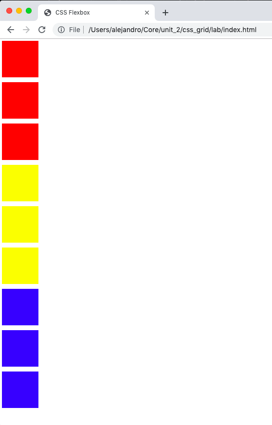
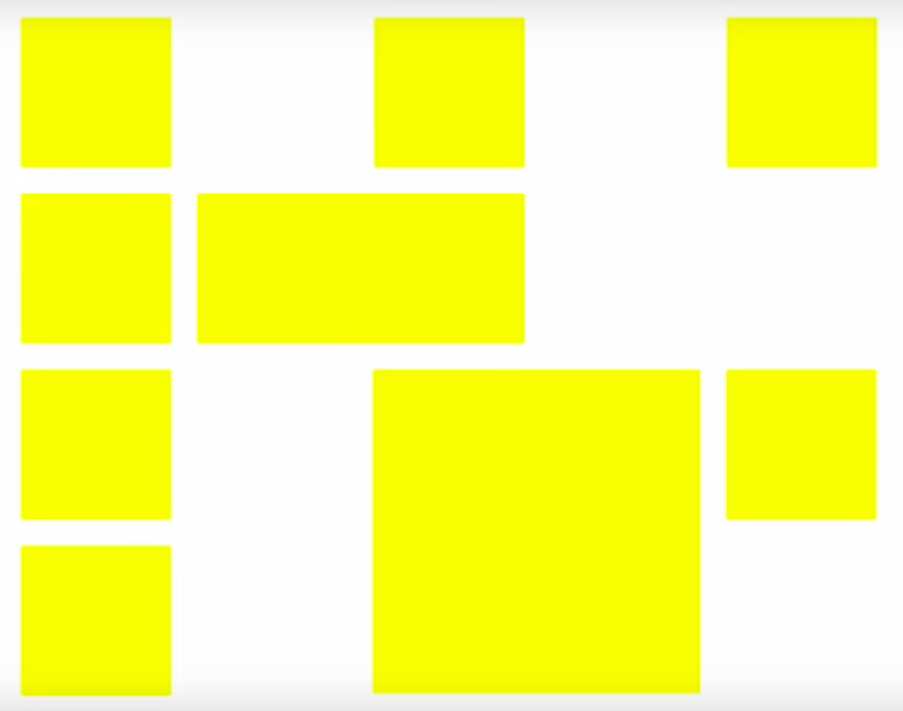
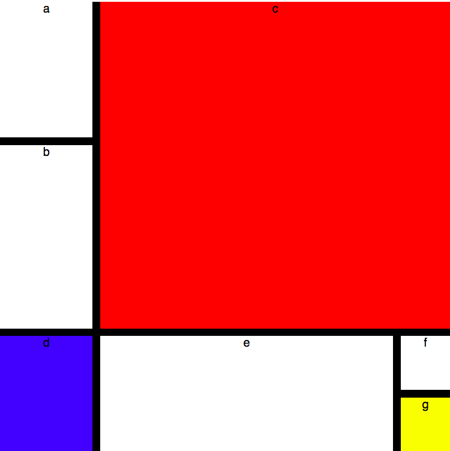

# CSS Grid Lab

1. Play [Grid Garden](https://cssgridgarden.com/) all the way through.

2. Fork and clone this repo. Then, observe our `index.html` file. It should be familiar to you from your Flexbox assignment. Modify only the CSS **Do not edit the HTML**

    This time, it's your task to:

    - Group like colors.
    - Stack them in a single long column, 150px in width.
    - The order of colors should be as follows: red, yellow, blue.
    - Your end product should look like this
    

## Bonus

1. Create the HTML and CSS to replicate this layout on a page. Name your files `layout1.html` & `layout1.css`

2. Create the HTML and CSS to replicate a painting by [Mondrian](https://en.wikipedia.org/wiki/Piet_Mondrian). Pick a piece you like or use this one as a starting point. Name your files `mondrian.html` & `mondrian.css`

