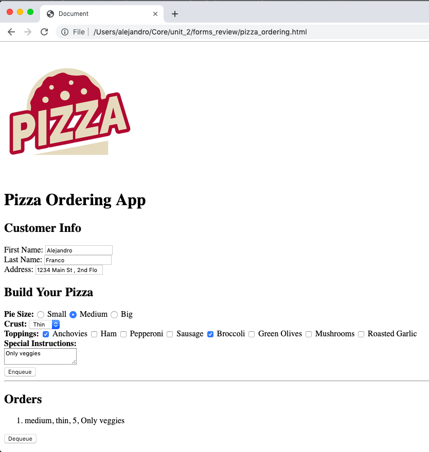

# DOM Forms Review Practice

## Steps
1. Use `starter.html` as a starting point. Add an HTML Form that resembles the screenshot.

2. Add a script that waits for the DOM and handles the form submission.

    * When the form is submitted create an object with the information that the user entered. This object represents a pizza order and looks like this. Your object should use the same __key names__:

    ```js
    let order = {
      first_name: "Jhon",
      last_name: "Snow",
      address: "1234 Main St, 2nd Fl, Hometown",
      size: "small",
      crust: "thick",
      topping: [
        "1",
        "2",
        "4",
        "8"
      ],
      special_instructions: "No Cheese"
    }
    ```
    * Enqueue the `order` object into a `Queue` instance. Use the `Queue` class definition seen in [here](https://github.com/joinpursuit/DSA-Curriculum/tree/master/Queues/web)

3. Add JavaScript that handles the `Dequeue` button. 

4. **Note** the script in the head `<script src="enableDOMQueue.js" ></script>` has a function that will enable your Queue to display in the DOM. You must call the function `enableDOMQueue(yourQueue)` in the last line inside your event listener for `"DOMContentLoaded"`

5. **Note** Toppings values are like so: 
```
  1 = Anchovies
  2 = Ham
  3 = Pepperoni
  4 = Sausage
  5 = Broccoli
  6 = Green Olives
  7 = Mushrooms
  8 = Roasted Garlic
```
 


## Screenshots


### Enqueueing 


### Dequeueing 

